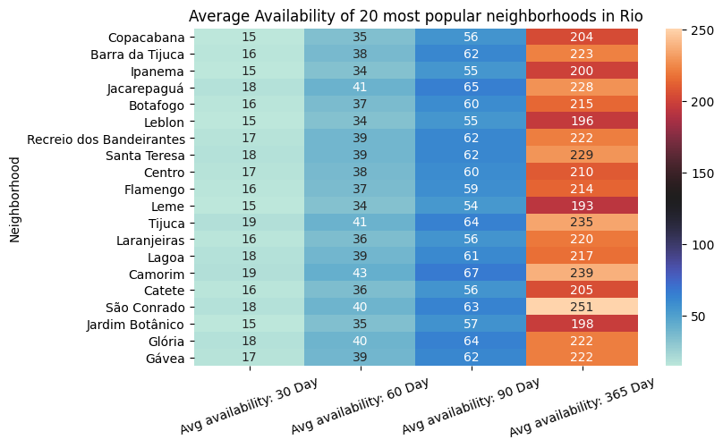
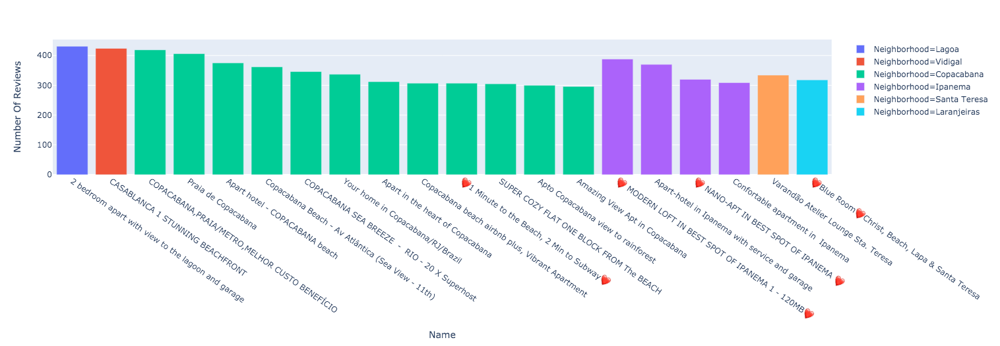

# Analysis, Language Detection, and ETL of Airbnb Rio de Janeiro

________________________________________________________________________________

Three projects are contained in this repository, all using a combination of user
reviews and listing data for Airbnb stays in Rio.

## RioEDA

Exploratory data analysis, discovering patterns in the data by taking aggregates,
creating visualizations, etc. Some viz examples are shown below.

### Average availability in top 20 districts

### Most popular listings

Notice how the listing name seems to correlate with popularity.

## RioETL

End-to-end cloud ETL pipeline on AWS. The data is loaded from a csv file stored
in an S3 bucket, and loaded into a postgreSQL database on RDS using
[Spark](https://spark.apache.org/)

## RioNLP 

Predicting the language of user reviews using a pretrained model from
[JohnSnowNLP](https://github.com/JohnSnowLabs/spark-nlp).

I belive this is a BERT model trained in a language-agnostic way
on various NLI tasks, and later fine-tuned for language prediction.

Using a pretrained model was orders of magnitude faster than training one
from scratch, and allowed for more time to be spent thinking about *uses*
of this result.

Considering this new feature, if you can reasonably associate language
with a certian world region then you could **answer the following questions:**

- Are international consumers a significant part of the usership in
certain cities?

- Are certain listings better at attracting people whose primary
language is not english?

- Are there patterns in sentiment across diffent languages/world regions?

This could power a number of **design initiatives at the platform level:**

- Rank listings shown to a visiting user according to their primary language

- Find listings that have extremely negative sentiment reviews
and rank them lower

This data can also be used to **inform real estate investors:**

- Are there differences in spending habits for international users?

- Are there ways to name/describe your listing that make them appeal
to a wider audience?

### Challenges

The spark related software versions that play well
with postgresql are not the same versions that
play well with `sparknlp`. Having a hard time isolating
the exact issue. Combining the NLP pipeline with the
visualization could be a way to avoid having to load language results
back into postgres.

### Potential future development

Use [LaBSE](https://ai.googleblog.com/2020/08/language-agnostic-bert-sentence.html) to generate more
powerful analytics on the text data.
